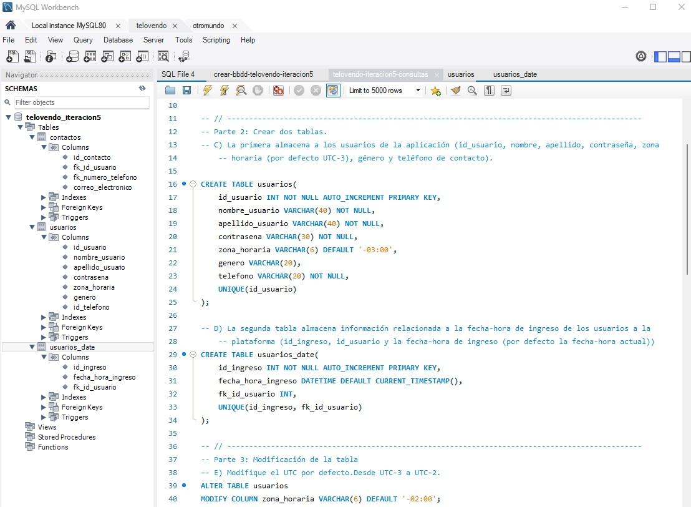

**_<h1 align="center">:vulcan_salute: Ejercicio Grupal Número 4 :computer:</h1>_**
**_<h2 align="center">Módulo 3 - Fundamentos de Bases de Datos Relacionales</h2>_**

- Creación de tablas
- Alteración para incorporar más llaves foráneas, creando un vínculo entre tablas
- Ingreso de usuarios

